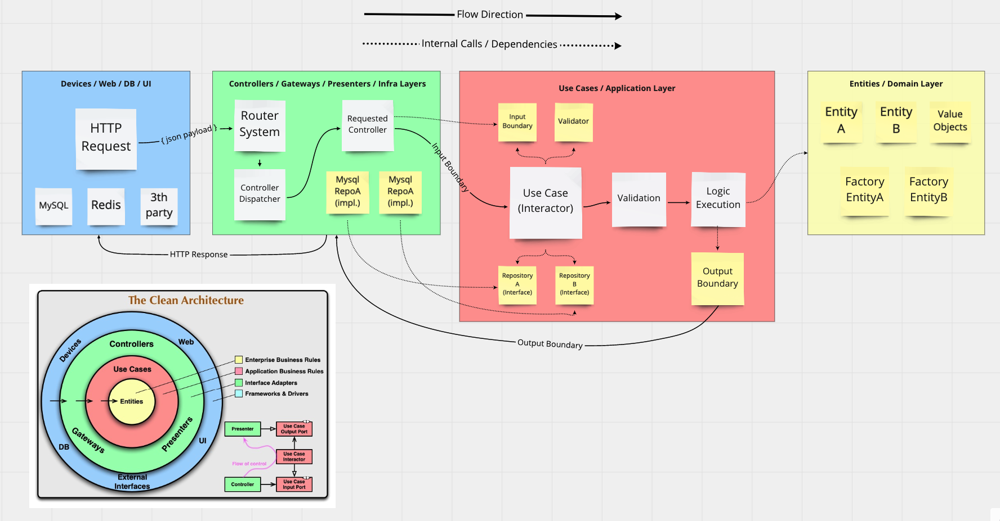

# Glofox Challenge!

## Author

Kilderson Sena - dersonsena@gmail.com

## Requirements

- PHP 7.4+;
- Unix Enviroment;
- [Composer](https://getcomposer.org);
- [Slim Framework 4](https://www.slimframework.com);
- [Docker](https://www.docker.com);
- Standard JSON Response Payload with [JSend](https://github.com/omniti-labs/jsend);

## Instructions for run the project

### Clone

Clone the project to your machine using the command:

```bash
$ git clone git@github.com:dersonsena/glofox-challenge.git
```

### Environment variables
Make a copy of the `.env.sample` file. To do this, open your terminal and run:

```bash
$ cp .env.sample .env
```

You can place the environment settings in the `.env` file as follows (note that the sample file is ready for basic use):

```
# ---------
# Docker
# ---------
PROJECT_NAME=glofox
DOCKER_APP_PORT=8000
DOCKER_MONGODB_PORT=27017
XDEBUG_CLIENT_PORT=9000
XDEBUG_REMOTE_PORT=9000

# ---------
# APPLICATION
# ---------
APP_ENV=dev
APP_DEBUG_ENABLED=1

# ---------
# MongoDB Database
# ---------
MONGODB_HOST=glofox-mongodb
MONGODB_PORT=27017
MONGODB_USERNAME=root
MONGODB_PASSWORD=secret
MONGODB_DATABASE=glofox
```

### Run app
To start your application and initialize your containers, just run the following command:

```bash
$ make up
$ make install
$ make db-import-members
```

If you have set the `DOCKER_APP_PORT` environment variable to `8000`, you can access the API via the following URL in any Rest Client (ex: Postman):

```
http://localhost:8000
```

## Archictecture

I used the Clean Architecture concepts and designed this project based flow below:



## Running Endpoints

### [POST] http://localhost:8000/classes (Create Classes)

#### Request Payload

```json
{
    "name": "Pilates",
    "start_date": "2021-02-10",
    "end_date": "2021-02-13",
    "capacity": 4
}
```

#### Response Payload

```json
{
    "status": "success",
    "data": {
        "id": "60242de53a916570493334b3"
    },
    "meta": []
}
```

#### Rules

1. All fields are required, so if you try to fill in as empty or remove this ones you should see a response payload with error details;
2. You must provide both dates in format `yyyy-mm-dd`;
3. If you provide a `start_date` greater than `end_date` you should see a response payload with date range error;

### [POST] http://localhost:8000/bookings (Book for a class)

#### Request Payload

Run the command below to get the member and lesson list from the storage:

```shell
$ make db-list-lessons
$ make db-list-members
```

In output commands you can see the lessons and members id's to be used in Request Payload below:

```json
{
    "memberId": "6023ff309f5531ca53dac037",
    "lessonId": "60242de53a916570493334b3",
    "date": "2021-02-10"
}
```

#### Response Payload

```json
{
    "status": "success",
    "data": {
        "bookingId": "60243a0658990e40ba2b087b",
        "member": {
            "name": "John",
            "gender": "MALE",
            "id": "6023ff309f5531ca53dac037"
        },
        "lesson": {
            "name": "Brazilian Jiu-jitsu",
            "startDate": "2021-01-25T19:54:46+00:00",
            "endDate": "2021-01-30T19:54:46+00:00",
            "capacity": 13,
            "id": "602400f458990e40ba2b0874"
        },
        "date": "2021-02-10T00:00:00+00:00"
    },
    "meta": []
}
```

#### Rules

1. All fields are required, so if you try to fill in as empty or remove this ones you should see a response payload with error details;
2. You must provide a valid `memberId`;
3. You must provide a valid `lessonId`;
4. You must provide a date in format `yyyy-mm-dd`;
5. You'll not be able to place the booking date outside the class range;
6. A member will not be able to make a booking for the same class and day that he has previously booked;
7. The member will not be able to make the booking if the places are exhausted (capacity limit reached);
